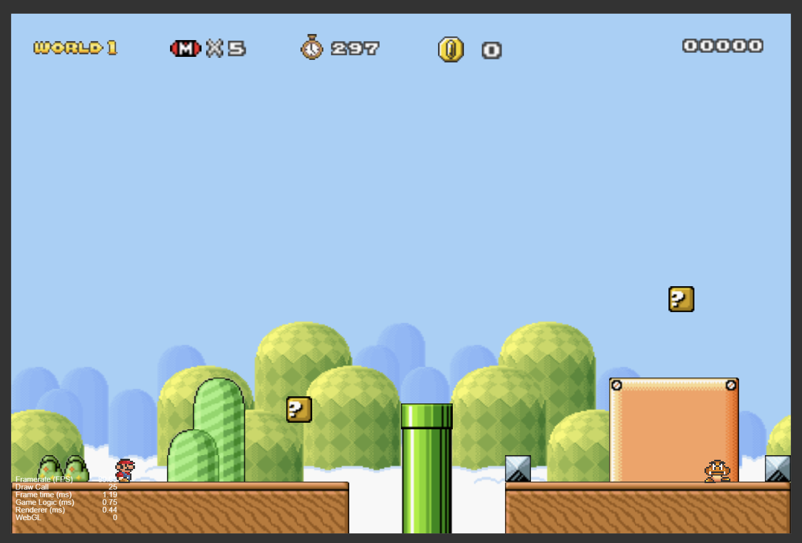
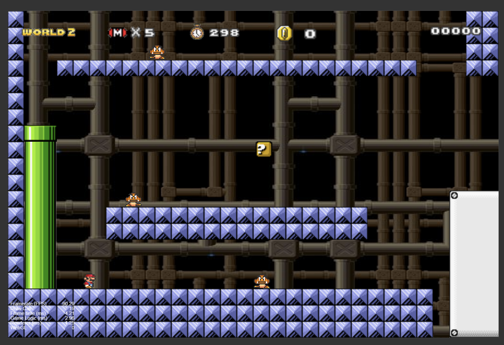
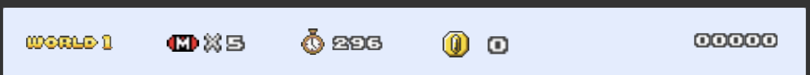
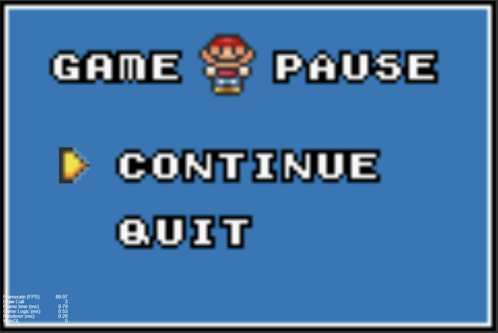
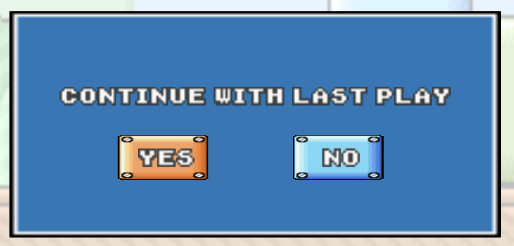

# Software Studio 2024 Spring Assignment 2

## Student ID : 111062215 Name : 熊恩伶

### Scoring

|**Basic Component**|**Score**|**Check**|
|:-:|:-:|:-:|
|Complete Game Process|5%|Y|
|Basic Rules|55%|Y|
|Animations|10%|Y|
|Sound Effects|10%|Y|
|UI|10%|Y|

|**Advanced Component**|**Score**|**Check**|
|:-:|:-:|:-:|
|firebase deploy|5%|Y|
|Leaderboard|5%|Y|
|Offline multi-player game|5%|N|
|Online multi-player game|10%|N|
|Others [name of functions]|1-10%|N|

---

## Basic Components Description : 
1. World map : 
    * level 1 [Sky Hill]
    
    * level 2 [Cave]
    
2. Player :  
    use &larr; &rarr; to move, &uarr; to jump
3. Enemies : 
    * goomba
    * flower
4. Question Blocks : 
    * mushroom
    * coin
5. Animations : 
    * player walk & jump
    * goomba walk
    * goomba die
    * flower
6. Sound effects :  
    * bgm
    * player jump & die
    * stomp
    * coin
    * powerup
    * powerdown
    * loseonelife
    * levelclear
7. UI : 
    * level
    * life
    * time
    * coin
    * points

## Advanced Component Description : 

* Firebase login/signup
* Save game state  
    when player die, he can choose to continue game or quit   
    (use &uarr; and &darr; to control, press 'enter' to confirm)
    
    If you choose quit, it will save current game state and go back to level select scene.
    When the player wants to enter game, it will ask player to start with a new game or continue with previous one
    
    (If no previous record and choose yes, it will still start with a new game)
* Leader Board

# Firebase page link (if you deploy)
https://mario-b95f0.web.app/

# Other
推薦使用90Hz左右的螢幕刷新率，若想體驗月球漫步版可使用60Hz